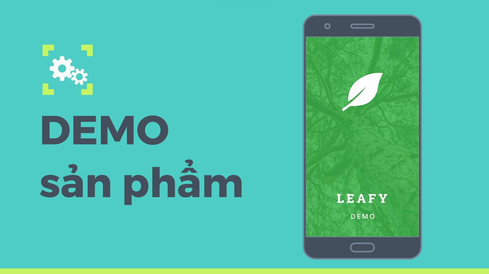
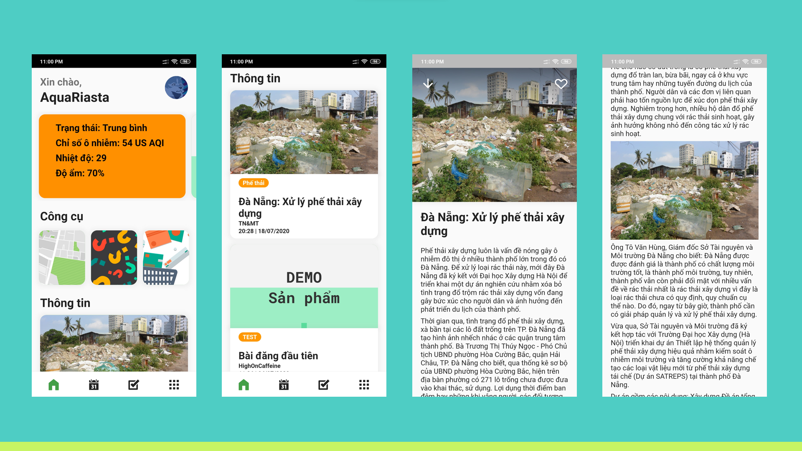
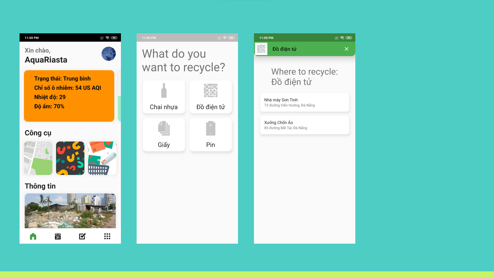
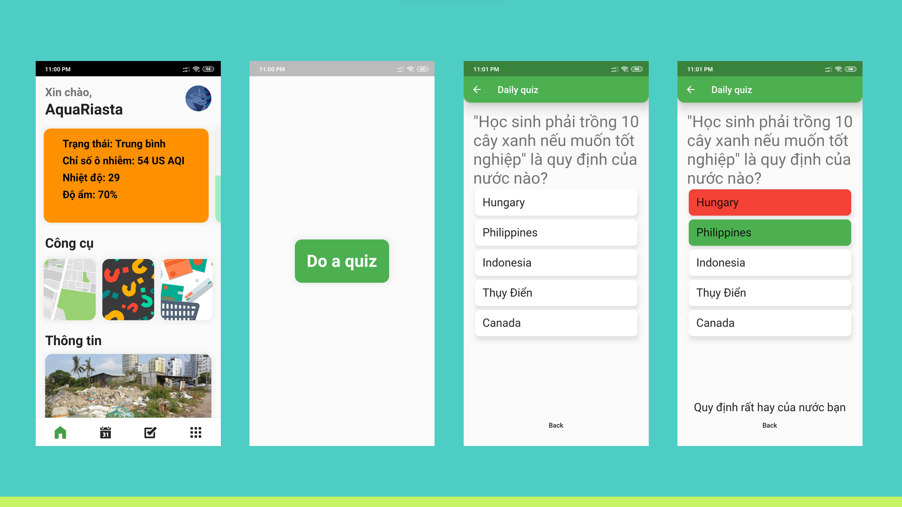
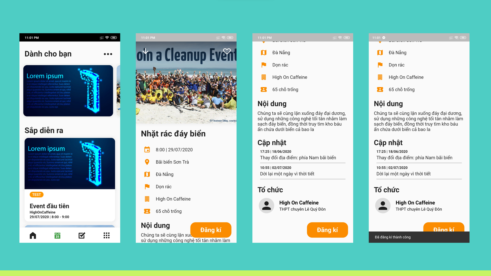
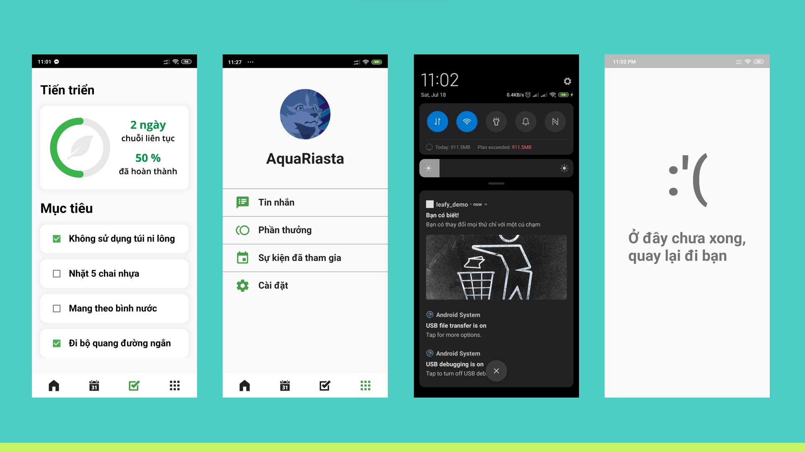

# Leafy - Event & Connection app for environmentalist

Leafy is an environmental app with two goals: Allow users to host and discover local environmental events and projects, providing a simple and convenient way to register and manage events; Educate people about the significance of the environment by increasing their environmental knowledge and showing them how they can help. The app promotes the transformation of an environmental project from a major formal event to a more casual one. Therefore, boosting the frequency of events, achieving greater environmental progress, and promoting users' sustainable lifestyles.
## Technology

This project is created with:
- Dart
- Flutter
- Firestore

## Problems
This is the first project created using the Flutter SDK. All the members in the group had no prior experience in software development. This is simply an UI implementation of the concept. Some functionalities are present; however, the app's architecture is severely lacking. There is no services & controllers, database, CRUD, state management, asynchronous programming - anything that is needed to create a functional app.

## Features

Despite that it is still an accomplishment as this is our first software project ever and it can run smoothly without any error on our test device.

Some of the features available are:

- News compilation
- Events feed & notifications
- Recycling locations
- Quiz & Challenges
- Product review and recommendation

## Screenshots

## Credits
[Nguyen Huu Phuong](https://www.linkedin.com/in/nghuuphuong/) - nghuuphuong@outlook.com

[Nguyen Hoang Minh](https://www.facebook.com/hoangminhnguyen.malego290704/) - malego290704@gmail.com
